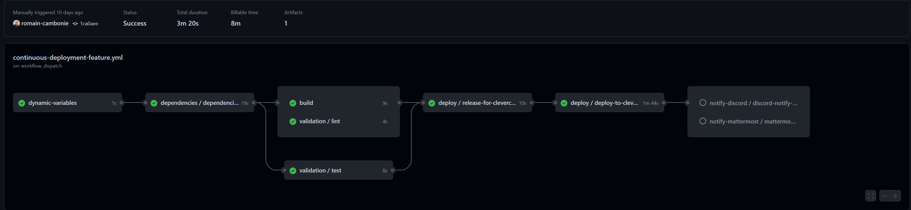

# Serenity Workflows

## About

Serenity workflows aim to provide easy to use, understand and modify reusable github actions workflows for common ci/cd use cases.

- Workflows DO NOT use marketplace actions or any dependencies except for github default actions.
- Workflows are given as local files for ease-of-modification and adaptation to your needs.

## Known Issues
- Hiding the SSH key log output with add-mask breaks the _deploy-application.scalingo.reusable workflow.

## Table des matières

- 🪧 [About](#about)
- 📦 [Prerequisites](#prerequisites)
- 🚀 [Installation](#installation)
- 🛠️ [Utilisation](#utilisation)
- 🤝 [Contribution](#contribution)
- 📚 [Documentation](#documentation)
- 📝 [Licence](#licence)

## Prerequisites

:warning: for a workflow to appear in your available workflows ({ YOUR_REPOSITORY_URL }/actions) a file with the same workflow name must be present on your default branch (usually master / main).

Workflow files contents are however branch dependent (so you can edit a workflow file and try it on a feature branch).

## Installation

- Copy the workflows files in your `.github/worflows` project folder.

- Commit / Push / Merge to your default (main / master) branch.

- Setup a deployer (Clevercloud / Scalingo ...)

- Fill the necessary env variables in a use case and run it.

## Utilisation

There are several types of workflow files :

### Setup
The setup files (*.setup.yml) are aimed to configure a deployer for the project.

They are run manually through the github action interface.

### Reusable workflows
The reusable workflows (.reusable.yml) are single responsibility building blocs that provide a service.
They are usually called by use-case workflows with inputs and may return several outputs

#### Available now:
##### Generic
- Cache dependencies using Yarn lockfile (nodes modules)
- Build application bundle
- Enumerate branches that follow a 'feature/*' name pattern
- Validation (run 'lint' and 'test' package.json scripts) 

##### Clevercloud specific
- Create/Deploy a node application
- Create/Deploy a static application
- Remove a deployed application

##### Scalingo specific
- Create/Deploy a node application
- Create a feature application with a copy of the database of a reference application

##### Deployment Notification hooks
- Discord
- Mattermost

### Use-Cases
Use-case workflows (*.use-case.yml) are used to provide complex scenarios.

They can be called by events (eg on branch push or merge) or event manually

#### Available as examples:
- Deploy an application on feature branch push (dep | build & validation | deploy | notify)

- On feature branch deletion / merge delete the associated deployed application.
- Start / Stop the demo instances according to team schedule (uncomment the 'schedule' to activate)

### Available Deployers
#### Clevercloud

###### Prerequisites
- Have a clevercloud account
- Clevercloud reusable workflows (files with the pattern _*.clevercloud.reusable.yml) must be in your default branch .github/workflows folder.

###### tl;dr 
Set up the
- CLEVER_TOKEN
- CLEVER_SECRET
- (Organisation) CLEVER_ORG_ID

repository variables.

[Step-by-step setup](./docs/clevercloud/clevercloud.md)

#### Scalingo
[Step-by-step setup](./docs/scalingo/scalingo.md)
[Postgresql addon workflow](./docs/scalingo/addon-postgresql.md)

## Contribution
Contributions are welcome ! Just submit a pull request with the files following the naming convention.

## Documentation
[GitHub Actions documentation](https://docs.github.com/en/actions)

## Troubleshooting, tips and tricks
[I cannot set my workflow env variables as reusable a workflow input](./docs/github-actions-tips.md)

## Licence

Voir le fichier [LICENSE](./LICENSE) du dépôt.